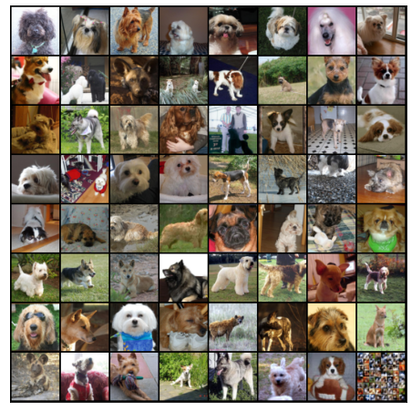
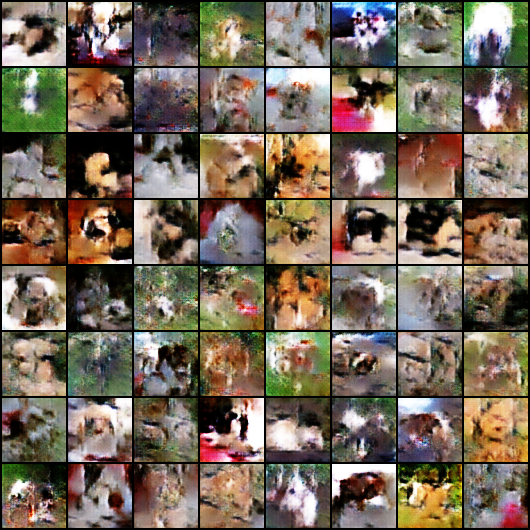

# DCGAN
Building DCGAN to generate Dog images using PyTorch   

## Implementation
After 9 hours of trainng on 6000 dog images for 60 epochs

## Input Image

## Output

End-product image:

Transformation:

  
